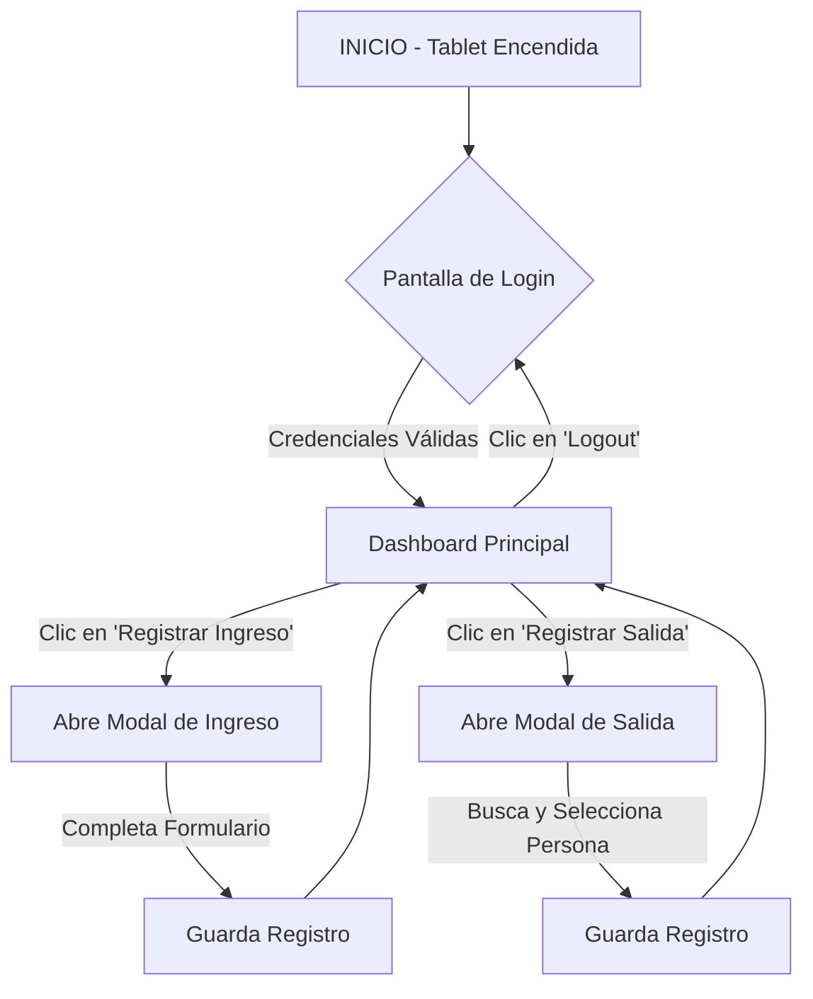

# 🔄 FLUJOS DE USUARIO Y DEFINICIONES OPERATIVAS

**Versión:** 2.0 (Consolidado)  
**Fecha:** 17-Oct-2025

> 📘 **Nota:** Este documento consolida el Flujo de Usuario (User Flow) y las Definiciones Operativas del sistema.

---

## 1. FLUJO PRINCIPAL DEL OPERADOR

### 1.1 Diagrama de Flujo



### 1.2 Casos de Uso Detallados

#### Caso 1: Inicio de Turno
1. Operador encuentra tablet en pantalla de **Login**
2. Ingresa `usuario` (cédula) y `contraseña`
3. Sistema valida y redirige a **Dashboard Principal**

#### Caso 2: Registro de Ingreso de Persona
1. Desde Dashboard, operador presiona **"Registrar Ingreso"**
2. Se abre **Modal de Ingreso**
3. Operador completa datos de la persona
4. Presiona **"Registrar"**
5. Modal se cierra, registro se guarda en IndexedDB
6. Dashboard actualiza estadísticas (+1 Personas Dentro)

#### Caso 3: Registro de Salida de Persona
1. Desde Dashboard, operador presiona **"Registrar Salida"**
2. Se abre **Modal de Salida**
3. Operador busca persona por C.I.
4. Selecciona persona de la lista
5. Presiona **"Registrar Salida"**
6. Modal se cierra, registro se actualiza
7. Dashboard actualiza estadísticas (-1 Personas Dentro)

#### Caso 4: Consulta Rápida
1. Dashboard muestra últimas personas que ingresaron
2. Click en **"Ver todas"** → Vista **Personas Dentro** completa
3. Lista con búsqueda y filtrado

---

## 2. FLUJO DE REGISTRO OPTIMIZADO

### 2.1 Objetivo de Rendimiento

**Meta:** <15 segundos para visitantes recurrentes (autocompletado)

### 2.2 Flujo Optimizado con Autocompletado

1. En modal de ingreso, operador ingresa **C.I.**
2. Sistema busca automáticamente si persona existe en registros anteriores
3. **Si existe:**
   - Campos **Nombre** y **Apellido** se rellenan automáticamente
   - Operador solo completa: Destino + datos opcionales (vehículo, acompañantes)
4. **Si NO existe:**
   - Operador completa todos los campos manualmente
5. Presiona **"Registrar Ingreso"** para completar

**Beneficios:**
- ✅ Reducción de tiempo: 60 segundos → 15 segundos (75% más rápido)
- ✅ Reducción de errores de tipeo
- ✅ Experiencia fluida para personal recurrente

---

## 3. GESTIÓN DE DATOS PARA SELECTORES

### 3.1 Decisión de Implementación

**Para Versión 1.0:** Listas estáticas definidas como constantes en código fuente

### 3.2 Justificación

- **Simplicidad y Robustez:** Evita complejidad de interfaz de administración
- **Rendimiento Offline:** Opciones siempre disponibles sin sincronización
- **Alcance del Proyecto:** Alineado con plazo de 4 semanas
- **Mejora Futura:** Gestión dinámica puede considerarse en v2.0

### 3.3 Implementación

**Ubicación:** `src/stores/app.ts` (configuración dinámica con IndexedDB)

**Lista de Destinos (actualizable):**
```typescript
// En app.ts store
config.value.destinos = [
  'IRCCA',
  'Ligeral', 
  'Simbiosys',
  'Jabelor',
  'Otra'
]
```

**Nota:** Implementación actual permite actualización dinámica mediante `updateDestinos()` método del store.

---

## 4. PROCESO DE CORRECCIÓN DE ERRORES

### 4.1 Reglas de Corrección (Rol Operador)

**Restricciones:**
- ✅ Operador **solo** puede modificar registros **creados por él mismo**
- ⏱️ Modificación **solo posible** dentro de **5 minutos** desde creación
- ⚠️ Después de 5 minutos → Procedimiento formal **Derechos ARCO** (Supervisor/Admin)

### 4.2 Flujo de Corrección

1. En lista "Últimos Ingresos" del Dashboard
2. Registros creados en últimos 5 min por usuario actual → muestran ícono **"Editar"** (`mdi-pencil`)
3. Click en ícono → Modal de registro precargado con datos
4. Operador realiza corrección
5. Presiona **"Guardar Cambios"**
6. Sistema actualiza registro en IndexedDB
7. **Auditoría:** Evento registrado en `audit_logs` como **MODIFICACIÓN**
   - Incluye: ID registro, ID operador, fecha/hora, campos modificados

### 4.3 Auditoría de Modificaciones

```typescript
// Estructura de evento de auditoría
{
  eventType: 'data_operation',
  action: 'registro.modified',
  details: {
    registroId: 'uuid',
    camposModificados: ['nombre', 'destino'],
    tiempoTranscurrido: 180 // segundos desde creación
  }
}
```

---

## 5. FLUJOS POR ROL

### 5.1 Operador

**Acciones permitidas:**
- ✅ Registrar ingresos
- ✅ Registrar salidas
- ✅ Consultar personas dentro
- ✅ Editar propios registros (<5 min)
- ❌ NO acceso a reportes PDF
- ❌ NO gestión de usuarios

**Flujo típico:**
```
Login → Dashboard → [Registrar Ingreso/Salida] → Consultar → Logout
```

---

### 5.2 Supervisor

**Acciones permitidas:**
- ✅ Consultar estadísticas (lectura)
- ✅ Generar reportes PDF
- ✅ Ver lista completa de personas/vehículos
- ❌ NO registrar ingresos/salidas
- ❌ NO gestión de usuarios

**Flujo típico:**
```
Login → Dashboard → [Ver estadísticas] → [Generar PDF] → Logout
```

---

### 5.3 Administrador

**Acciones permitidas:**
- ✅ Todo lo del Supervisor
- ✅ Gestión completa de usuarios
- ✅ Acceso a sistema de auditoría
- ✅ Configuración del sistema
- ✅ Gestión de backups

**Flujo típico:**
```
Login → Dashboard Admin → [Gestionar Usuarios] → [Ver Auditoría] → [Configuración] → Logout
```

---

## 6. GESTIÓN DE ESTADOS

### 6.1 Estados de Registro

| Estado | Descripción | Acción |
|--------|-------------|--------|
| **Ingreso** | Persona ha ingresado al predio | Aparece en "Personas Dentro" |
| **Salida** | Persona ha salido del predio | Se remueve de "Personas Dentro" |

### 6.2 Estados de Sesión

| Estado | Descripción | Duración |
|--------|-------------|----------|
| **Activa** | Usuario autenticado trabajando | Hasta logout manual |
| **Inactiva** | Sin actividad detectada | Advertencia a 28 min |
| **Expirada** | Timeout alcanzado | Cierre forzado a 30 min |

---

## 7. VALIDACIONES Y REGLAS DE NEGOCIO

### 7.1 Validaciones de Entrada

**Cédula (C.I.):**
- ✅ Exactamente 8 dígitos numéricos
- ✅ Solo números, sin puntos ni guiones
- ❌ No permite letras ni caracteres especiales

**Matrícula (Vehículo):**
- ✅ Formato uruguayo: ABC1234 o ABC-1234
- ✅ 3 letras + 4 números
- ⚠️ Validación flexible para formatos antiguos

**Nombre/Apellido:**
- ✅ Solo letras y espacios
- ✅ Mínimo 2 caracteres
- ✅ Primera letra mayúscula (auto-format)

### 7.2 Reglas de Negocio

**Registro de Salida:**
- ✅ Solo se puede registrar salida de personas **actualmente dentro**
- ✅ Búsqueda por C.I. solo muestra registros con estado "Ingreso" sin salida correspondiente
- ⚠️ Si persona tiene múltiples ingresos → mostrar el más reciente

**Vehículos:**
- ✅ Máximo 1 vehículo por registro de ingreso
- ✅ Vehículo sale automáticamente con la persona titular
- ⚠️ Acompañantes NO pueden tener vehículo propio

---

## 8. MANEJO DE ERRORES Y EDGE CASES

### 8.1 Errores Comunes

| Escenario | Comportamiento | Solución |
|-----------|----------------|----------|
| Usuario sin conexión | PWA funciona offline completo | Sin impacto en operación |
| IndexedDB llena | Advertencia cuando <10% espacio | Notificar para limpieza de datos antiguos |
| Registro duplicado (misma C.I. dentro) | Permitir, mostrar advertencia | Operador decide si proceder |
| Salida sin ingreso previo | Bloqueado | Mensaje: "Persona no encontrada dentro del predio" |

### 8.2 Recuperación de Errores

**Si falla guardado de registro:**
1. Mostrar mensaje de error claro
2. Mantener datos en formulario (no limpiar)
3. Permitir reintentar operación
4. Registrar error en auditoría

---

**Documentos consolidados en esta versión:**
- `03-user-flow.md` (49 líneas)
- `04-operational-definitions.md` (71 líneas)

**Total:** 120 líneas → 270 líneas (información expandida + consolidada)
