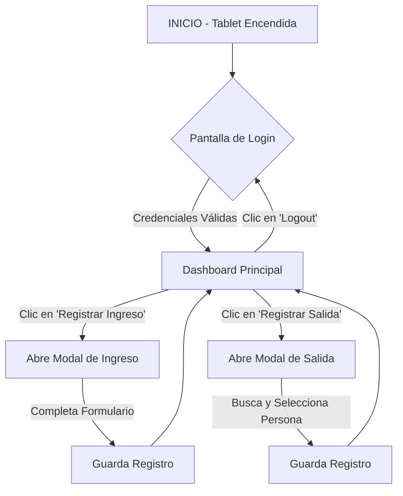

# Flujo de Usuario - Sistema de Control de Accesos del IRCCA

**Versión:** 1.0  
**Fecha:** 10-Sep-2025

Este documento describe el flujo de navegación principal para los operadores del sistema de registro.

---

## Flujo Principal del Operador

El ciclo de vida de una sesión de operador está diseñado para ser simple y eficiente.

### Casos de Uso Detallados

1.  **Inicio de Turno:**
    - El operador encuentra la tablet en la pantalla de **Login**.
    - Ingresa su `usuario` y `PIN`.
    - Al validar, el sistema lo redirige al **Dashboard Principal**.

2.  **Registro de Ingreso de Persona:**
    - Desde el **Dashboard**, el operador presiona "Registrar Ingreso".
    - Se abre un **Modal de Ingreso**.
    - El operador completa los datos de la persona y presiona "Registrar".
    - El modal se cierra, el registro se guarda en IndexedDB, y el **Dashboard** se actualiza con las nuevas estadísticas (ej. +1 Personas Dentro).

3.  **Registro de Salida de Persona:**
    - Desde el **Dashboard**, el operador presiona "Registrar Salida".
    - Se abre un **Modal de Salida**.
    - El operador busca a la persona por su C.I., la selecciona de la lista y presiona "Registrar".
    - El modal se cierra, el registro se actualiza, y el **Dashboard** se actualiza nuevamente.

4.  **Consulta Rápida:**
    - El **Dashboard** muestra una lista de las últimas personas que ingresaron.
    - Para ver la lista completa, un botón "Ver todas" redirige a la vista de **Personas Dentro**.
